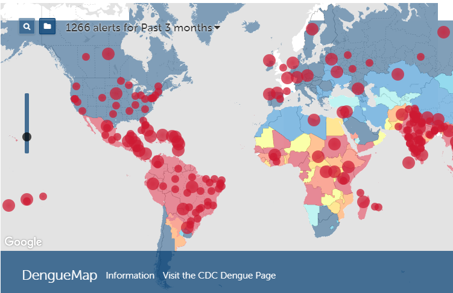

# INTRODUCTION
The goal is to **predict the number of dengue cases each week (in two different locations)** based on environmental variables describing changes in temperature, precipitation, vegetation, and more. You can read more about this competition [here](https://www.drivendata.org/competitions/44/dengai-predicting-disease-spread/). 

**MAE** of 25.32

**CURRENT RANK**: 877 / 7354

# TECHNICAL APPROACH
This is only a summary of the process, If you want to know more details, you can read the report in [saramarlop.com](http://saramarlop.com/)

## 1. FIRST STEPS

- **Exploratory analysis**
- **Cleaning and preparing datasets**:
  - Imputing missing values 
  - Dealing with outliers
  - Fixing some mislabeled weeks  

- **Reducing dimensionality**:
  - Removing redundant predictors (using a threshold = 0.80)
 
## 2. FEATURE ENGINEERING
 - Creating lag features.

## 3. MODELING & ERROR ANALYSIS 
- We run two random forest (one per city)
- We analyzed the errors 

